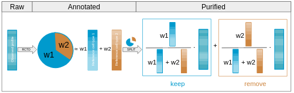

<!-- badges: start -->
[](https://github.com/BDSC-tds/SPLIT/actions/workflows/R-CMD-check.yaml)
[](https://doi.org/10.1038/s41592-026-03089-8)
[](https://github.com/bdsc-tds/SPLIT/releases/tag/v0.2.0)
<!-- badges: end -->

# SPLIT: Spatial Purification of Layered Intracellular Transcripts



🚧 **This package is under active development.** ❗ Make sure you use the latest version (i.e., [v0.2.0](https://github.com/bdsc-tds/SPLIT/releases/tag/v0.2.0)).

⚡ Use the **Quick Start** guide below to get up and running quickly.

🆕🔥 A **comprehensive tutorial** of running SPLIT on **ATERA** (full-transcriptome spatial) data and its comparison to **Xenium** is available as [.Rmd](https://github.com/bdsc-tds/SPLIT/blob/main/vignettes/ATERA_vs_Xenium_comparison_plus_SPLIT.Rmd) and [.html](https://github.com/bdsc-tds/SPLIT/blob/main/doc/ATERA_vs_Xenium_comparison_plus_SPLIT.html) (SPLIT v0.2.0 runs in minutes on full-transcriptome data). ❗ Requires [SPLIT v0.2.0](https://github.com/bdsc-tds/SPLIT/releases/tag/v0.2.0) or later.

📖 A **comprehensive tutorial** of running SPLIT on Xenium data is available as [.Rmd](https://github.com/bdsc-tds/SPLIT/blob/main/vignettes/Run_RCTD_and_SPLIT_on_Xenium.Rmd) and [.html](https://github.com/bdsc-tds/SPLIT/blob/main/doc/Run_RCTD_and_SPLIT_on_Xenium.html) (<30 min total runtime on a standard PC, incl. 4 min for SPLIT with a peak memory usage of ~21 GB).

🆕🔥 A **comprehensive tutorial** of running SPLIT on **VisiumHD** data is available as [.Rmd](https://github.com/bdsc-tds/SPLIT/blob/main/vignettes/Run_RCTD_and_SPLIT_on_VisiumHD.Rmd) and [.html](https://github.com/bdsc-tds/SPLIT/blob/main/doc/Run_RCTD_and_SPLIT_on_VisiumHD.html) (~30 min total runtime on a standard PC, incl. 10 min for SPLIT with a peak memory usage of ~52 GB). ❗ Requires [SPLIT v0.1.2](https://github.com/bdsc-tds/SPLIT/releases/tag/v0.1.2) or later.


------------------------------------------------------------------------

## What's new in v0.2.0

- **Annotation-method agnostic**: SPLIT no longer depends on RCTD output. It now accepts any deconvolution result — all you need is a cells x cell-types weight matrix, a genes x cell-types reference, and optionally a primary cell-type vector (otherwise inferred as the argmax of the weights).
- **Full-transcriptome compatible**: SPLIT now scales to large full-transcriptome platforms such as **ATERA** (~18,000 genes) and runs to completion in minutes.
- **VisiumHD and Xenium support** remains fully intact and backward compatible.
- **Faster and leaner**: improved chunked sparse-matrix computation reduces peak memory usage and runtime across all platforms.

------------------------------------------------------------------------

## 📦 Installation

To install SPLIT from GitHub:

```r
remotes::install_github("bdsc-tds/SPLIT")
```

------------------------------------------------------------------------

## 🚀 Quick Start

### RCTD-based (legacy, backward compatible)

If you already have your dataset as a Seurat object (`xe`) and **RCTD** results from doublet-mode decomposition, you can run SPLIT as before:

```r
library(SPLIT)
library(Seurat)

# Post-process RCTD output
RCTD <- SPLIT::run_post_process_RCTD(RCTD)

# Run SPLIT purification
res_split <- SPLIT::purify(
  counts = GetAssayData(xe, assay = "Xenium", layer = "counts"),
  rctd   = RCTD,
  DO_purify_singlets = TRUE
)

# Create a purified Seurat object
xe_purified <- CreateSeuratObject(
  counts    = res_split$purified_counts,
  meta.data = res_split$cell_meta,
  assay     = "Xenium"
)

# Optional: filter, normalize and visualize
xe_purified <- subset(xe_purified, subset = nCount_Xenium > 5)
xe_purified <- xe_purified %>%
  SCTransform(assay = "Xenium") %>%
  RunPCA() %>%
  RunUMAP(dims = 1:20)

UMAPPlot(xe_purified, group.by = "first_type", label = TRUE, repel = TRUE) +
  theme(aspect.ratio = 1)
```

### Annotation-method agnostic (v0.2.0+)

Provide deconvolution weights, a reference matrix, and primary cell-type labels from any annotation tool:

```r
library(SPLIT)
library(Seurat)

# Extract deconvolution weights, primary cell-type vector and reference matrix
# from any deconvolution result (shown here with RCTD for illustration)
new_input <- SPLIT::convert_rctd_result_to_purify_input(rctd = RCTD)

# Run SPLIT purification — returns a SingleCellExperiment object
res_split <- SPLIT::purify(
  counts                = GetAssayData(xe, assay = "Xenium", layer = "counts"),
  reference             = t(new_input$reference),          # genes x cell-types
  primary_cell_type     = new_input$primary_cell_type,     # named character vector
  deconvolution_weights = new_input$deconvolution_weights, # cells x cell-types
  DO_output_sce         = TRUE   # set FALSE to get a plain list instead
)

# Create a purified Seurat object from the SCE output
xe_purified <- CreateSeuratObject(
  counts    = assay(res_split, "purified_counts"),
  meta.data = as.data.frame(colData(res_split)),
  assay     = "Xenium"
)

# Optional: filter, normalize and visualize
xe_purified <- subset(xe_purified, subset = nCount_Xenium > 5)
xe_purified <- xe_purified %>%
  SCTransform(assay = "Xenium") %>%
  RunPCA() %>%
  RunUMAP(dims = 1:20)

UMAPPlot(xe_purified, group.by = "first_type", label = TRUE, repel = TRUE) +
  theme(aspect.ratio = 1)
```

------------------------------------------------------------------------

## Citation

If you use **SPLIT** in your work, please cite:

> **Resolving sensitivity, specificity and signal contamination in Xenium spatial transcriptomics**\
> Mariia Bilous, Daria Buszta, Jonathan Bac, Senbai Kang, Yixing Dong, Stephanie Tissot, Sylvie Andre, Marina Alexandre-Gaveta, Christel Voize, Solange Peters, Krisztian Homicsko, Raphael Gottardo\
> *Nature Methods* (2026). <https://doi.org/10.1038/s41592-026-03089-8>

------------------------------------------------------------------------

## Contact

If you have any questions about the package, feel free to [open an issue](https://github.com/bdsc-tds/SPLIT/issues) or contact **Mariia Bilous** at [Mariia.Bilous@chuv.ch](mailto:Mariia.Bilous@chuv.ch).
