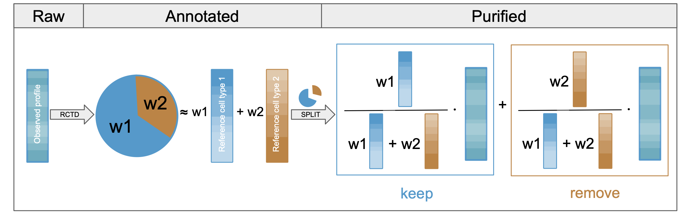

<!-- badges: start --> 
[](https://github.com/BDSC-tds/SPLIT/actions/workflows/R-CMD-check.yaml) 
[](https://doi.org/10.1101/2025.04.23.649965)
[](https://github.com/bdsc-tds/SPLIT/releases/tag/v0.1.0)
<!-- badges: end -->

# SPLIT: Spatial Purification of Layered Intracellular Transcripts



🚧 **This package is under active development.**\
⚡ Use the **Quick Start** guide below to get up and running quickly.\
📖 A **comprehensive tutorial** of running SPLIT on Xenium data is now available as 👉 [.Rmd](https://github.com/bdsc-tds/SPLIT/blob/main/vignettes/Run_RCTD_and_SPLIT_on_Xenium.Rmd) and [.html](https://github.com/bdsc-tds/SPLIT/blob/main/doc/Run_RCTD_and_SPLIT_on_Xenium.html).

------------------------------------------------------------------------

## 📦 Installation

To install SPLIT from GitHub:

``` r
# Install SPLIT
remotes::install_github("bdsc-tds/SPLIT")
```

## 🚀 Quick Start

⚠️ **IMPORTANT:**\
SPLIT currently requires **doublet-mode** RCTD results from the original [spacexr GitHub repository](https://github.com/dmcable/spacexr) or its faster [HD fork](https://github.com/jpromeror/spacexr/tree/HD), **not** from the newly released [Bioconductor version](https://www.bioconductor.org/packages/release/bioc/html/spacexr.html).\
🚧 **Compatibility with Bioconductor's spacexr is coming soon.**

If you already have your **Xenium** dataset as a Seurat object (`xe`) and **RCTD** results from **doublet-mode** decomposition in `RCTD`, you can run SPLIT purification like this:

```{r}
library(SPLIT)
library(spacexr)
library(dplyr)
library(Seurat)
library(ggplot2)

# Post-process RCTD output
RCTD <- SPLIT::run_post_process_RCTD(RCTD)

# Run SPLIT purification
res_split <- SPLIT::purify(
  counts = GetAssayData(xe, assay = 'Xenium', layer = 'counts'), # or any gene x cells counts matrix
  rctd = RCTD,
  DO_purify_singlets = TRUE # optional
)

# Create a purified Seurat object
xe_purified <- CreateSeuratObject(
  counts = res_split$purified_counts,
  meta.data = res_split$cell_meta,
  assay = "Xenium"
)

# Optional: Filter, normalize and visualize
xe_purified <- subset(xe_purified, subset = nCount_Xenium > 5)
xe_purified <- xe_purified %>%
  SCTransform(assay = "Xenium") %>%
  RunPCA() %>%
  RunUMAP(dims = 1:20)
UMAPPlot(xe_purified, group.by = c("first_type"), label = T, repel = T) + theme(aspect.ratio = 1)
```

## Citation

If you use **SPLIT** in your work, please cite:

> **From Transcripts to Cells: Dissecting Sensitivity, Signal Contamination, and Specificity in Xenium Spatial Transcriptomics**\
> Mariia Bilous, Daria Buszta, Jonathan Bac, Senbai Kang, Yixing Dong, Stephanie Tissot, Sylvie Andre, Marina Alexandre-Gaveta, Christel Voize, Solange Peters, Krisztian Homicsko, Raphael Gottardo\
> *bioRxiv* (2025). <https://doi.org/10.1101/2025.04.23.649965>

## Contact

If you have any questions about the package, feel free to [open an issue](https://github.com/bdsc-tds/SPLIT/issues) or contact **Mariia Bilous** at [Mariia.Bilous\@chuv.ch](mailto:Mariia.Bilous@chuv.ch).
